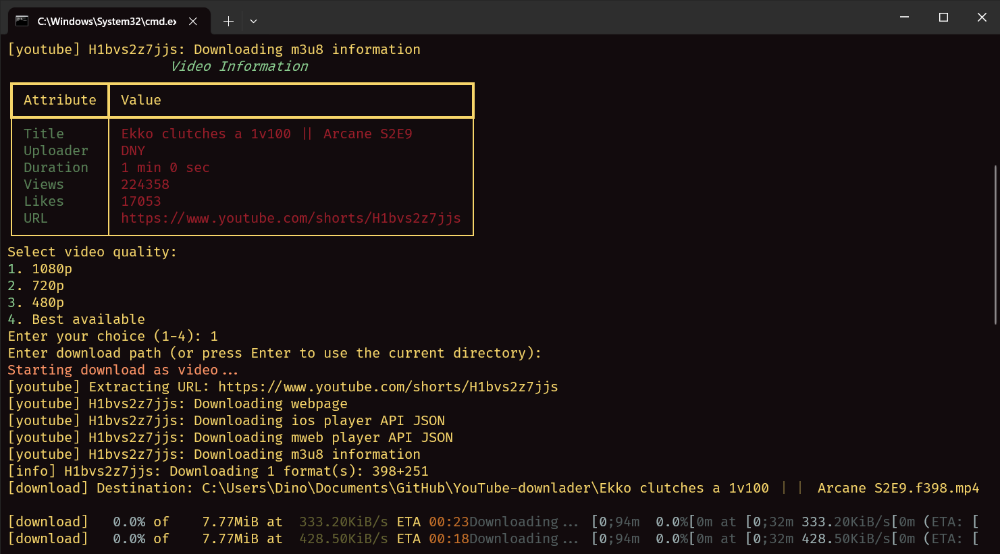

# YouTube Downloader

A powerful and visually engaging command-line application to download YouTube videos and audio using the `yt-dlp` library. This program supports specifying the download path, video quality selection, and provides detailed information about the video before downloading.

## Features
- **Download Videos**: Choose your preferred video quality (1080p, 720p, 480p, or best available).
- **Download Audio**: Extract high-quality MP3 audio from YouTube videos.
- **Custom Download Path**: Save downloads to any directory of your choice.
- **Video Information**: Displays detailed metadata about the video, including title, uploader, views, and likes.
- **Interactive Menu**: User-friendly interface with vibrant and animated elements.
- **Cross-Platform**: Works seamlessly on Windows, macOS, and Linux.

## Prerequisites
- Python 3.7 or newer
- FFmpeg (required for audio extraction; [download here](https://ffmpeg.org/download.html))

## Installation
1. Clone the repository or download the script:
   ```bash
   git clone https://github.com/your-repo/yt-downloader.git
   cd yt-downloader
   ```

2. Install the required Python packages:
   ```bash
   pip install -r requirements.txt
   ```

3. (Optional) Install FFmpeg for audio extraction:
   - **Windows**: [Download FFmpeg](https://ffmpeg.org/download.html), extract it, and add the `bin` folder to your system's PATH.
   - **macOS/Linux**: Install via a package manager like `brew` or `apt`:
     ```bash
     brew install ffmpeg  # macOS
     sudo apt install ffmpeg  # Linux
     ```

## Usage
Run the program with:
```bash
python yt_downloader.py
```

### Menu Options
1. **Download Video**: Enter the YouTube URL and choose the desired video quality.
2. **Download Audio**: Enter the YouTube URL to extract high-quality MP3 audio.
3. **Exit**: Closes the program.

### Example Usage
1. Launch the program.
2. Select the type of download (video/audio).
3. Enter the YouTube URL when prompted.
4. (For videos) Select the desired quality.
5. Specify the download path (leave blank to use the current directory).
6. Wait for the download to complete.

## Libraries Used
- **[yt-dlp](https://github.com/yt-dlp/yt-dlp)**: A feature-rich YouTube downloader library.
- **[rich](https://github.com/Textualize/rich)**: For creating a beautiful command-line interface.
- **tqdm**: Adds progress bars and animations.

## Screenshots



## License
This project is licensed under the MIT License. Feel free to use, share, and modify.

## Contributing
Contributions are welcome! If you find a bug or have a feature request, please open an issue or submit a pull request.

